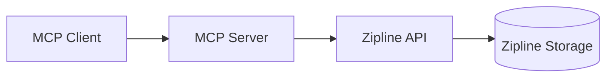

# Architecture

## System Architecture

The Zipline MCP Server acts as a bridge between MCP clients and Zipline's file hosting service.

### Key Components

1. **MCP Client**: Initiates file upload requests (e.g., Claude Desktop).
2. **MCP Server**:
   - Validates files locally.
   - Generates upload commands.
   - Handles authentication with Zipline.
   - Manages temporary files in a sandboxed environment using `tmp_file_manager` and downloads external URLs using `download_external_url`.
3. **Zipline API**: Processes upload requests and returns URLs.
4. **Zipline Storage**: Persistent file storage system.

### Typical Workflow

1. Client sends file path to MCP server.
2. Server validates file type and size.
3. Server constructs authenticated API request.
4. Zipline processes upload and returns URL.
5. Server formats response for MCP client.

## Source Code Paths

- `src/index.ts`: Main entry point, registers MCP tools, handles server startup.
- `src/httpClient.ts`: Contains `uploadFile` and `downloadExternalUrl` functions for interacting with the Zipline API and external URLs.
- `src/sandboxUtils.ts`: Provides utilities for managing the secure, per-user temporary file sandbox.
- `src/userFiles.ts`: Contains functionality for listing and searching user files stored on the Zipline server, including FileModel interface, listUserFiles function, and the normalizeUrl utility for consistent URL construction.
- `src/download.test.ts`, `src/download.integration.test.ts`, `src/httpClient.test.ts`, `src/index.test.ts`, `src/sandboxUtils.test.ts`, `src/userFiles.test.ts`: Test files for various modules.

## Key Technical Decisions

- **Node.js & TypeScript**: Chosen for server-side logic due to performance and type safety.
- **@modelcontextprotocol/sdk**: Used for MCP server implementation, providing standard communication.
- **Zod**: For input schema validation, ensuring robust and predictable tool arguments.
- **Fetch API**: Used for HTTP requests, available natively in Node.js >= 18.
- **Multipart/form-data**: For file uploads to Zipline.
- **Secure Sandboxing**: Implemented for temporary file management to prevent path traversal and ensure per-user isolation.
- **Environment Variables**: For sensitive information like `ZIPLINE_TOKEN` and `ZIPLINE_ENDPOINT`.
- **URL Normalization**: Centralized URL construction through the `normalizeUrl` utility to ensure consistent URL formatting regardless of endpoint configuration.

## Design Patterns in Use

- **Modular Design**: Code is separated into distinct modules (`httpClient`, `sandboxUtils`) for better organization and reusability.
- **Event-driven (Implicit)**: MCP server operates on incoming tool calls, responding to events from clients.
- **Input Validation**: Extensive use of Zod schemas and custom validation functions to ensure data integrity and security.
- **Single Source of Truth**: URL construction is centralized in the `normalizeUrl` function to ensure consistency across all tools.

## Component Relationships

- `index.ts` orchestrates the registration of tools that leverage `httpClient.ts`, `sandboxUtils.ts`, and `userFiles.ts`.
- `httpClient.ts` depends on `sandboxUtils.ts` for downloading external URLs into the sandbox.
- `userFiles.ts` provides standalone functionality for listing and searching user files on the Zipline server, with URL normalization handled by the `normalizeUrl` utility.
- The `list_user_files` and `get_user_file` tools return normalized URLs for consistent access to files.
- The `update_user_file` and `delete_user_file` tools exclude URL fields from their responses for cleaner API design.
- Tests are structured to mirror the source code, ensuring comprehensive coverage.
