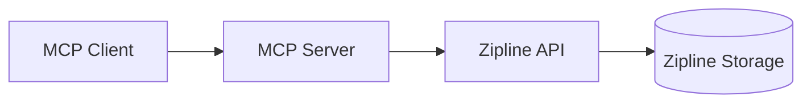

# Zipline MCP Server

An MCP (Model Context Protocol) server that allows you to upload files to a Zipline-compatible host. This server provides tools for uploading files, validating them, and generating upload commands.

## Features

- Upload files to a Zipline instance
- Validate files before uploading
- Preview upload commands
- Get only the download URL after upload
- Support for multiple file types, including:
  - Text/code: txt, md, gpx, html, json, xml, csv, js, css, py, sh, yaml, yml
  - Images: png, jpg, jpeg, gif, webp, svg, bmp, tiff, ico, heic, avif

## Installation

### Global Installation

To install the server globally so you can use it with `npx`:

```bash
npm install -g zipline-mcp
```

### Local Installation

To install the server as a dependency in your project:

```bash
npm install zipline-mcp
```

## Usage

### Using with `npx`

If you installed the server globally, you can run it directly:

```bash
npx zipline-mcp
```

### Adding to MCP Client Configuration

To use this server with an MCP client (like Claude Desktop), you need to add it to your client's configuration file.

### MCP-Zipline Integration Guide

#### Quickstart Configuration

Add this minimal configuration to your MCP client (e.g., Claude Desktop):

```yaml
# YAML format
mcpServers:
  zipline:
    command: npx
    args: ['-y', 'zipline-mcp']
    environment:
      ZIPLINE_TOKEN: 'your-api-token-here'
      ZIPLINE_ENDPOINT: 'http://localhost:3000'
```

```json
// JSON format
{
  "mcpServers": {
    "zipline": {
      "command": "npx",
      "args": ["-y", "zipline-mcp"],
      "environment": {
        "ZIPLINE_TOKEN": "your-api-token-here",
        "ZIPLINE_ENDPOINT": "http://localhost:3000"
      }
    }
  }
}
```

#### Detailed Configuration Options

##### Required Settings

- `command`: The executable to run (typically "npx")
- `args`: Array containing ["zipline-mcp"]
- `environment.ZIPLINE_TOKEN`: Your Zipline API token
- `environment.ZIPLINE_ENDPOINT`: The URL of your Zipline server (default is "http://localhost:3000")

##### Optional Settings

- `environment.ZIPLINE_FORMAT`: File naming format. Supported values: "random", "uuid", "date", "name", "gfycat" (alias for "random-words"), "random-words". Defaults to "random".
- `environment.ZIPLINE_ENDPOINT`: Custom Zipline server URL
- `environment.ZIPLINE_DISABLE_SANDBOXING`: Disable per-user sandboxing for the tmp_file_manager tool. Set to "true" to disable sandboxing and use the shared `~/.zipline_tmp` directory for all users. Defaults to "false" (sandboxing enabled).
- `environment.ALLOWED_EXTENSIONS`: **Override the list of allowed file extensions for upload and validation.** Provide a comma-separated list (e.g., `.txt,.md,.pdf,.docx`). If set, this will replace the default list of allowed extensions. Useful for restricting or expanding supported file types in your deployment.

#### Security Best Practices

1. Store API tokens in environment variables, not in config files
2. Use HTTPS for all connections to Zipline servers

#### Troubleshooting Common Issues

##### Authentication Failures

- Symptom: "Invalid authorization token" errors
- Solutions:
  - Verify token validity
  - Check for typos in the ZIPLINE_TOKEN value
  - Ensure token is passed via environment variable

## Architecture Overview

The Zipline MCP Server acts as a bridge between MCP clients and Zipline's file hosting service. Here's how the components interact:



### Key Components

1. **MCP Client**: Initiates file upload requests (e.g., Claude Desktop)
2. **MCP Server**:
   - Validates files locally
   - Generates upload commands
   - Handles authentication with Zipline
3. **Zipline API**: Processes upload requests and returns URLs
4. **Zipline Storage**: Persistent file storage system

### Typical Workflow

1. Client sends file path to MCP server
2. Server validates file type and size
3. Server constructs authenticated API request
4. Zipline processes upload and returns URL
5. Server formats response for MCP client

### Format Options

The `format` parameter controls how uploaded files are named on the Zipline server. Here are the supported formats:

#### `random`

Generates a random filename with characters, with length defined by the server configuration. This is the default format.

#### `uuid`

Generates a UUID-based filename (e.g., `550e8400-e29b-41d4-a716-446655440000`).

#### `date`

Uses the current date/time formatted according to the server's default date format. Note that date formatting is handled entirely by the Zipline server.

#### `name`

Uses the original filename without its extension (e.g., `document.txt` becomes `document`).

#### `gfycat`

Alias for `random-words`. Provides human-readable "random words" style filenames.

#### `random-words`

Generates human-readable filenames using random words (e.g., `happy-purple-elephant`).

#### Format Normalization and Validation

- **Case-insensitive**: All format values are case-insensitive (e.g., `UUID`, `uuid`, and `Uuid` are equivalent).
- **Alias handling**: `gfycat` is automatically mapped to `random-words`.
- **Error handling**: Invalid format values will result in an "Invalid format" error.
- **Default behavior**: If the format parameter is omitted, the server uses its configured default format (typically `random`).

#### Examples

```bash
# Use UUID format
upload_file_to_zipline(filePath: "document.txt", format: "uuid")

# Use human-readable format (via alias)
upload_file_to_zipline(filePath: "document.txt", format: "gfycat")

# Case-insensitive usage
upload_file_to_zipline(filePath: "document.txt", format: "RANDOM-WORDS")
```

### Enhanced Upload Options

The Zipline MCP Server now supports additional optional headers that provide enhanced control over file uploads. These headers are sent as `x-zipline-*` headers to the Zipline server.

#### `x-zipline-deletes-at`

Controls when the uploaded file should be automatically deleted.

**Formats:**

- **Relative duration**: Strings like "1d" (1 day), "2h" (2 hours), "30m" (30 minutes)
- **Absolute date**: ISO-8601 format with "date=" prefix, e.g., "date=2025-12-31T23:59:59Z"

**Examples:**

```javascript
// Delete after 24 hours
uploadFile({
  filePath: 'document.txt',
  format: 'random',
  deletesAt: '1d',
});

// Delete at specific date
uploadFile({
  filePath: 'document.txt',
  format: 'random',
  deletesAt: 'date=2025-12-31T23:59:59Z',
});
```

**Validation:**

- Relative durations must be positive and use valid units (d, h, m)
- Absolute dates must be in ISO-8601 format and specify a future date
- Invalid formats will be rejected with descriptive error messages

#### `x-zipline-password`

Protects the uploaded file with a password. When this header is provided, users will need to enter the password to access the file.

**Format:**

- Non-empty string value

**Examples:**

```javascript
uploadFile({
  filePath: 'secret.txt',
  format: 'random',
  password: 'my-secret-password',
});
```

**Validation:**

- Password must be a non-empty string
- Whitespace-only passwords are rejected
- **Security**: Passwords are never logged or exposed in error messages

#### `x-zipline-max-views`

Limits the number of times a file can be viewed before it becomes unavailable. Each successful view decrements the counter.

**Format:**

- Non-negative integer (0 or greater)

**Examples:**

```javascript
// Allow 10 views
uploadFile({
  filePath: 'document.txt',
  format: 'random',
  maxViews: 10,
});

// Allow single view (disposable link)
uploadFile({
  filePath: 'document.txt',
  format: 'random',
  maxViews: 1,
});
```

**Validation:**

- Must be an integer ≥ 0
- Negative numbers and non-integer values are rejected
- When counter reaches 0, file becomes eligible for removal

#### `x-zipline-folder`

Specifies the ID of the folder where the upload should be placed. The folder must exist on the Zipline server.

**Format:**

- Alphanumeric string (letters and numbers only)

**Examples:**

```javascript
uploadFile({
  filePath: 'document.txt',
  format: 'random',
  folder: 'myfolder123',
});
```

**Validation:**

- Must be a non-empty alphanumeric string
- Special characters and whitespace are rejected
- If the specified folder doesn't exist, the upload will fail

#### Combining Multiple Headers

You can combine multiple headers for enhanced control:

```javascript
uploadFile({
  filePath: 'document.txt',
  format: 'random',
  deletesAt: '7d', // Delete after 7 days
  password: 'secret123', // Password protect
  maxViews: 5, // Allow 5 views
  folder: 'shared', // Place in "shared" folder
});
```

#### Error Handling

All headers are validated locally before the upload request is sent to the server. If any header is invalid:

- The upload is aborted immediately
- A descriptive error message is returned
- No HTTP request is made to the Zipline server
- The error message explains exactly what needs to be fixed

#### Backward Compatibility

All enhanced headers are **optional**. Existing code that doesn't use these headers will continue to work exactly as before. The new functionality only activates when you explicitly provide these parameters.

### Available Tools

This server provides the following tools:

#### `upload_file_to_zipline`

Uploads a file to the Zipline server and returns a detailed success message.

- `filePath`: Path to the file to upload. Supported extensions: txt, md, gpx, html, json, xml, csv, js, css, py, sh, yaml, yml, png, jpg, jpeg, gif, webp, svg, bmp, tiff, ico, heic, avif
- `originalName`: (optional) Original filename to preserve during download. This parameter is sent as the `x-zipline-original-name` header to the Zipline server. The original filename will be used when downloading the file, not when storing it. Must be a non-empty string without path separators.

#### `validate_file`

Checks if a file exists and is suitable for upload.

- `filePath`: Path to the file to validate. Supported extensions: txt, md, gpx, html, json, xml, csv, js, css, py, sh, yaml, yml, png, jpg, jpeg, gif, webp, svg, bmp, tiff, ico, heic, avif

#### `tmp_file_manager`

Minimal, sandboxed file management with per-user isolation. Each user gets their own sandbox directory based on their ZIPLINE_TOKEN. Only bare filenames are allowed (no subdirectories or path traversal). All operations are strictly limited to the user's sandbox.

- `command`: One of:
  - `LIST` — List all files in the user's sandbox
  - `CREATE <filename>` — Create or overwrite a file (optionally provide `content`)
  - `OPEN <filename>` or `READ <filename>` — Read file content (max 1MB)
  - `PATH <filename>` — Get the absolute path of a file in the sandbox
- `content`: (optional) String content for `CREATE`

**Examples:**

- `LIST`
- `CREATE notes.txt` (with or without content)
- `OPEN notes.txt`
- `READ notes.txt`
- `PATH notes.txt`

**Sandboxing Configuration:**

- Per-user sandboxing is enabled by default
- To disable sandboxing and use the shared `~/.zipline_tmp` directory for all users, set `ZIPLINE_DISABLE_SANDBOXING=true` in your environment
- When sandboxing is disabled, session locking and TTL cleanup are also disabled

**Per-User Sandboxing (when enabled):**

- Each user gets a unique sandbox directory at `~/.zipline_tmp/users/{hash}` where `hash` is a SHA-256 hash of the user's ZIPLINE_TOKEN
- Sandboxes are automatically created with 0700 permissions for security
- All file operations are isolated within the user's sandbox
- Sandboxes older than 24 hours are automatically cleaned up

**Session Locking (when sandboxing is enabled):**

- Each user's sandbox is locked during operations to prevent concurrent access
- Locks automatically expire after 30 minutes
- The system prevents race conditions when multiple clients access the same sandbox

**Safety:**

- Only bare filenames allowed (no `/`, `\`, `..`, or absolute paths)
- Any attempt to access outside the user's sandbox is refused with an explicit error
- Files larger than 1MB cannot be read
- Subdirectories are not supported
- Each user's sandbox is isolated from others (when sandboxing is enabled)

### download_external_url

A new tool has been added: `download_external_url`. It lets the MCP server (and therefore models) download an external HTTP(S) URL into the caller's sandbox and returns the absolute filesystem path to the saved file.

- Tool name: `download_external_url`
- Purpose: Download an external HTTP(S) resource into the per-user sandbox and return the absolute path where the file was stored.
- Input schema:
  - `url` (string) — required — HTTP or HTTPS URL to download
  - `timeoutMs` (number) — optional — request timeout in milliseconds (default: 30000)
  - `maxFileSizeBytes` (number) — optional — maximum allowed file size in bytes (default: 100 _ 1024 _ 1024 = 100 MB)
- Behavior:
  - Validates the provided URL and only allows `http:` and `https:` schemes.
  - Uses an AbortController to enforce the configured timeout.
  - Checks the `Content-Length` header when present and rejects downloads that declare a size larger than the configured maximum.
  - Downloads into the user's sandbox directory (same sandbox used by the `tmp_file_manager` tool) and returns the absolute path, e.g. `/home/user/.zipline_tmp/users/<hash>/file.ext`.
  - If the remote resource does not provide a filename, a safe deterministic name is used.
  - Partial files are cleaned up on failure to avoid leaving incomplete artifacts in the sandbox.
  - Structured logs are emitted via the existing sandbox logging facility for observability.

Usage example (MCP tool call)

- Example input:
  {
  "url": "https://example.com/files/document.pdf",
  "timeoutMs": 30000,
  "maxFileSizeBytes": 104857600
  }
- Example successful response content:
  "✅ DOWNLOAD COMPLETE\n\nLocal path: /home/user/.zipline_tmp/users/abc123/document.pdf"

Security & safety considerations

- Only `http` and `https` are accepted. Other schemes (ftp, file, etc.) are rejected.
- Default file size limit: 100 MB. You can override via `maxFileSizeBytes` but be cautious.
- The downloader follows redirects but enforces the maximum redirect behavior in code (to avoid redirect loops).
- All downloads are saved inside the per-user sandbox; filenames are validated and sanitized using the same rules as `tmp_file_manager` (no path separators, no dot segments, no absolute paths).
- The server logs download activity with sanitized paths (user portion masked) for observability; secrets (such as tokens) are never logged.
- If you require domain allow-listing to restrict where the server can download from, consider adding a hostname whitelist at the MCP server configuration level before enabling this tool for production usage.

Notes for integrators

- This tool is exported by the MCP server and can be invoked programmatically by MCP clients or models.
- The implementation lives in [`src/httpClient.ts`](src/httpClient.ts:1) and the MCP registration is in [`src/index.ts`](src/index.ts:1).
- Tests were added under `src/download.test.ts` and `src/download.integration.test.ts` to exercise validation, timeout, size limits, and cleanup behavior.

### Sandbox Path Resolution

The `tmp_file_manager` tool uses a secure path resolution mechanism to ensure all file operations stay within sandbox boundaries. This is implemented through the `resolveSandboxPath` function which provides the following security guarantees:

**Path Validation:**

- **Filename Validation**: All filenames are validated to prevent path traversal attacks
- **Absolute Path Resolution**: Converts relative filenames to absolute paths within the sandbox
- **Boundary Enforcement**: Ensures resolved paths cannot escape the sandbox directory
- **Error Handling**: Throws `SandboxPathError` for any violation with clear error messages

**Security Features:**

- **Input Sanitization**: Rejects filenames containing path separators (`/`, `\`), dot segments (`..`), or absolute paths
- **Path Normalization**: Resolves paths to their canonical form to prevent symbolic link attacks
- **Containment Verification**: Verifies that the final resolved path is within the sandbox boundaries
- **Audit Logging**: All sandbox operations are logged with sanitized paths for security monitoring

**Implementation Details:**

```typescript
// Example of secure path resolution
function resolveSandboxPath(filename: string): string {
  const userSandbox = getUserSandbox();

  // Validate filename first
  const validationError = validateFilename(filename);
  if (validationError) {
    throw new SandboxPathError(validationError);
  }

  const resolved = path.resolve(userSandbox, filename);

  // Security: Ensure resolved path is within sandbox
  if (!resolved.startsWith(userSandbox)) {
    throw new SandboxPathError(`Path traversal attempt: ${filename}`);
  }

  return resolved;
}
```

**Error Examples:**

- `CREATE ../evil.txt` → Error: Filenames must not include path separators, dot segments, or be empty. Only bare filenames in ~/.zipline_tmp are allowed.
- `OPEN /etc/passwd` → Error: Filenames must not include path separators, dot segments, or be empty. Only bare filenames in ~/.zipline_tmp are allowed.
- `READ ../../system/file` → Error: Path traversal attempt: ../../system/file

**Logging and Auditing:**

All sandbox operations are logged with security-sensitive information sanitized:

```
[2025-01-15T10:30:45.123Z] SANDBOX_OPERATION: FILE_CREATED - notes.txt - Path: /home/user/.zipline_tmp/users/[HASH] - Size: 42 bytes
```

User-specific paths are masked with `[HASH]` to prevent token leakage in logs while maintaining traceability.

## Development

### Prerequisites

- Node.js (v18 or higher)
- npm or yarn

### Setup

1. Clone the repository:

```bash
git clone https://github.com/dorogoy/zipline-mcp.git
cd zipline-mcp
```

2. Install dependencies:

```bash
npm install
```

### Scripts

- `npm run build`: Build the TypeScript project.
- `npm run start`: Run the built server.
- `npm run dev`: Run the server in development mode with `tsx`.
- `npm run test`: Run tests in watch mode.
- `npm run test:run`: Run tests once.
- `npm run lint`: Lint the codebase using ESLint.
- `npm run lint:fix`: Automatically fix lint errors where possible.
- `npm run format`: Format the codebase with Prettier.
- `npm run format:check`: Check if the codebase is formatted.

### Linting

#### Running Lint Locally

To check for lint errors:

```bash
npm run lint
```

To automatically fix fixable issues:

```bash
npm run lint:fix
```

Or use the Makefile:

```bash
make lint
```

#### Lint in CI

- Linting runs automatically on every pull request and before every release.
- The CI will fail if there are any lint errors.
- Linting is required for merging PRs.

#### Interpreting Lint Results

- Errors will be shown in the terminal or CI logs.
- Fix errors locally using `npm run lint:fix` or by editing the code as indicated.
- Warnings do not block CI but should be addressed for code quality.

### Makefile

A `Makefile` is provided for convenience:

```bash
make install      # Install dependencies
make build       # Build the project
make test        # Run tests
make lint        # Lint the code
make format      # Format the code
make clean       # Clean build artifacts
make publish     # Publish to npm
```

## License

MIT
