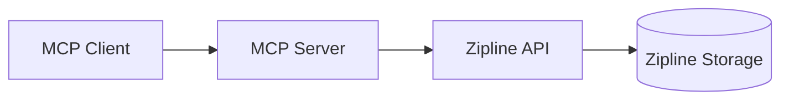

# Zipline MCP Server

An MCP (Model Context Protocol) server that allows you to upload files to a Zipline-compatible host. This server provides tools for uploading files, validating them, and generating upload commands.

## Features

- Upload files to a Zipline instance
- Validate files before uploading
- Preview upload commands
- Get only the download URL after upload
- Support for multiple file types, including:
  - Text/code: txt, md, gpx, html, json, xml, csv, js, css, py, sh, yaml, yml
  - Images: png, jpg, jpeg, gif, webp, svg, bmp, tiff, ico, heic, avif

## Installation

### Global Installation

To install the server globally so you can use it with `npx`:

```bash
npm install -g zipline-mcp
```

### Local Installation

To install the server as a dependency in your project:

```bash
npm install zipline-mcp
```

## Usage

### Using with `npx`

If you installed the server globally, you can run it directly:

```bash
npx zipline-mcp
```

### Adding to MCP Client Configuration

To use this server with an MCP client (like Claude Desktop), you need to add it to your client's configuration file.

### MCP-Zipline Integration Guide

#### Quickstart Configuration

Add this minimal configuration to your MCP client (e.g., Claude Desktop):

```yaml
# YAML format
mcpServers:
  zipline:
    command: npx
    args: ['zipline-mcp']
    environment:
      ZIPLINE_TOKEN: 'your-api-token-here'
```

```json
// JSON format
{
  "mcpServers": {
    "zipline": {
      "command": "npx",
      "args": ["zipline-mcp"],
      "environment": {
        "ZIPLINE_TOKEN": "your-api-token-here"
      }
    }
  }
}
```

#### Detailed Configuration Options

##### Required Settings

- `command`: The executable to run (typically "npx")
- `args`: Array containing ["zipline-mcp"]
- `environment.ZIPLINE_TOKEN`: Your Zipline API token

##### Optional Settings

- `environment.ZIPLINE_FORMAT`: File naming format. Supported values: "random", "uuid", "date", "name", "gfycat" (alias for "random-words"), "random-words". Defaults to "random".
- `environment.ZIPLINE_ENDPOINT`: Custom Zipline server URL

#### Security Best Practices

1. Store API tokens in environment variables, not in config files
2. Use HTTPS for all connections to Zipline servers
3. Restrict token permissions to only required scopes

#### Troubleshooting Common Issues

##### Authentication Failures

- Symptom: "Invalid authorization token" errors
- Solutions:
  - Verify token validity and permissions
  - Check for typos in the ZIPLINE_TOKEN value
  - Ensure token is passed via environment variable

## Architecture Overview

The Zipline MCP Server acts as a bridge between MCP clients and Zipline's file hosting service. Here's how the components interact:



### Key Components

1. **MCP Client**: Initiates file upload requests (e.g., Claude Desktop)
2. **MCP Server**:
   - Validates files locally
   - Generates upload commands
   - Handles authentication with Zipline
3. **Zipline API**: Processes upload requests and returns URLs
4. **Zipline Storage**: Persistent file storage system

### Typical Workflow

1. Client sends file path to MCP server
2. Server validates file type and size
3. Server constructs authenticated API request
4. Zipline processes upload and returns URL
5. Server formats response for MCP client

### Format Options

The `format` parameter controls how uploaded files are named on the Zipline server. Here are the supported formats:

#### `random`
Generates a random filename with characters, with length defined by the server configuration. This is the default format.

#### `uuid`
Generates a UUID-based filename (e.g., `550e8400-e29b-41d4-a716-446655440000`).

#### `date`
Uses the current date/time formatted according to the server's default date format. Note that date formatting is handled entirely by the Zipline server.

#### `name`
Uses the original filename without its extension (e.g., `document.txt` becomes `document`).

#### `gfycat`
Alias for `random-words`. Provides human-readable "random words" style filenames.

#### `random-words`
Generates human-readable filenames using random words (e.g., `happy-purple-elephant`).

#### Format Normalization and Validation

- **Case-insensitive**: All format values are case-insensitive (e.g., `UUID`, `uuid`, and `Uuid` are equivalent).
- **Alias handling**: `gfycat` is automatically mapped to `random-words`.
- **Error handling**: Invalid format values will result in an "Invalid format" error.
- **Default behavior**: If the format parameter is omitted, the server uses its configured default format (typically `random`).

#### Examples

```bash
# Use UUID format
upload_file_to_zipline(filePath: "document.txt", format: "uuid")

# Use human-readable format (via alias)
upload_file_to_zipline(filePath: "document.txt", format: "gfycat")

# Case-insensitive usage
upload_file_to_zipline(filePath: "document.txt", format: "RANDOM-WORDS")
```

### Available Tools

This server provides the following tools:

#### `upload_file_to_zipline`

Uploads a file to the Zipline server and returns a detailed success message.

- `filePath`: Path to the file to upload. Supported extensions: txt, md, gpx, html, json, xml, csv, js, css, py, sh, yaml, yml, png, jpg, jpeg, gif, webp, svg, bmp, tiff, ico, heic, avif
- `format` (optional): Filename format. Supported values: "random", "uuid", "date", "name", "gfycat" (alias for "random-words"), "random-words". Defaults to "random".

#### `get_upload_url_only`

Uploads a file and returns only the download URL.

- `filePath`: Path to the file to upload. Supported extensions: txt, md, gpx, html, json, xml, csv, js, css, py, sh, yaml, yml, png, jpg, jpeg, gif, webp, svg, bmp, tiff, ico, heic, avif
- `format` (optional): Filename format. Supported values: "random", "uuid", "date", "name", "gfycat" (alias for "random-words"), "random-words". Defaults to "random".

#### `preview_upload_command`

Generates and previews the curl command that will be used for uploading.

- `filePath`: Path to the file to upload. Supported extensions: txt, md, gpx, html, json, xml, csv, js, css, py, sh, yaml, yml, png, jpg, jpeg, gif, webp, svg, bmp, tiff, ico, heic, avif
- `format` (optional): Filename format. Supported values: "random", "uuid", "date", "name", "gfycat" (alias for "random-words"), "random-words". Defaults to "random".

#### `validate_file`

Checks if a file exists and is suitable for upload.

- `filePath`: Path to the file to validate. Supported extensions: txt, md, gpx, html, json, xml, csv, js, css, py, sh, yaml, yml, png, jpg, jpeg, gif, webp, svg, bmp, tiff, ico, heic, avif

#### `tmp_file_manager`

Minimal, sandboxed file management in `~/.zipline_tmp`. Only bare filenames are allowed (no subdirectories or path traversal). All operations are strictly limited to this directory.

- `command`: One of:
  - `LIST` — List all files in `~/.zipline_tmp`
  - `CREATE <filename>` — Create or overwrite a file (optionally provide `content`)
  - `OPEN <filename>` or `READ <filename>` — Read file content (max 1MB)
- `content`: (optional) String content for `CREATE`

**Examples:**
- `LIST`
- `CREATE notes.txt` (with or without content)
- `OPEN notes.txt`
- `READ notes.txt`

**Safety:**
- Only bare filenames allowed (no `/`, `\`, `..`, or absolute paths)
- Any attempt to access outside `~/.zipline_tmp` is refused with an explicit error
- Files larger than 1MB cannot be read
- Subdirectories are not supported

**Error Example:**
- `CREATE ../evil.txt` → Error: Operation refused. Filenames must not include path separators or dot segments. Only bare filenames in `~/.zipline_tmp` are allowed.

## Development

### Prerequisites

- Node.js (v18 or higher)
- npm or yarn

### Setup

1. Clone the repository:

```bash
git clone https://github.com/dorogoy/zipline-mcp.git
cd zipline-mcp
```

2. Install dependencies:

```bash
npm install
```

### Scripts

- `npm run build`: Build the TypeScript project.
- `npm run start`: Run the built server.
- `npm run dev`: Run the server in development mode with `tsx`.
- `npm run test`: Run tests in watch mode.
- `npm run test:run`: Run tests once.
- `npm run lint`: Lint the codebase using ESLint.
- `npm run lint:fix`: Automatically fix lint errors where possible.
- `npm run format`: Format the codebase with Prettier.
- `npm run format:check`: Check if the codebase is formatted.

### Linting

#### Running Lint Locally

To check for lint errors:

```bash
npm run lint
```

To automatically fix fixable issues:

```bash
npm run lint:fix
```

Or use the Makefile:

```bash
make lint
```

#### Lint in CI

- Linting runs automatically on every pull request and before every release.
- The CI will fail if there are any lint errors.
- Linting is required for merging PRs.

#### Interpreting Lint Results

- Errors will be shown in the terminal or CI logs.
- Fix errors locally using `npm run lint:fix` or by editing the code as indicated.
- Warnings do not block CI but should be addressed for code quality.

### Makefile

A `Makefile` is provided for convenience:

```bash
make install      # Install dependencies
make build       # Build the project
make test        # Run tests
make lint        # Lint the code
make format      # Format the code
make clean       # Clean build artifacts
make publish     # Publish to npm
```

## License

MIT
